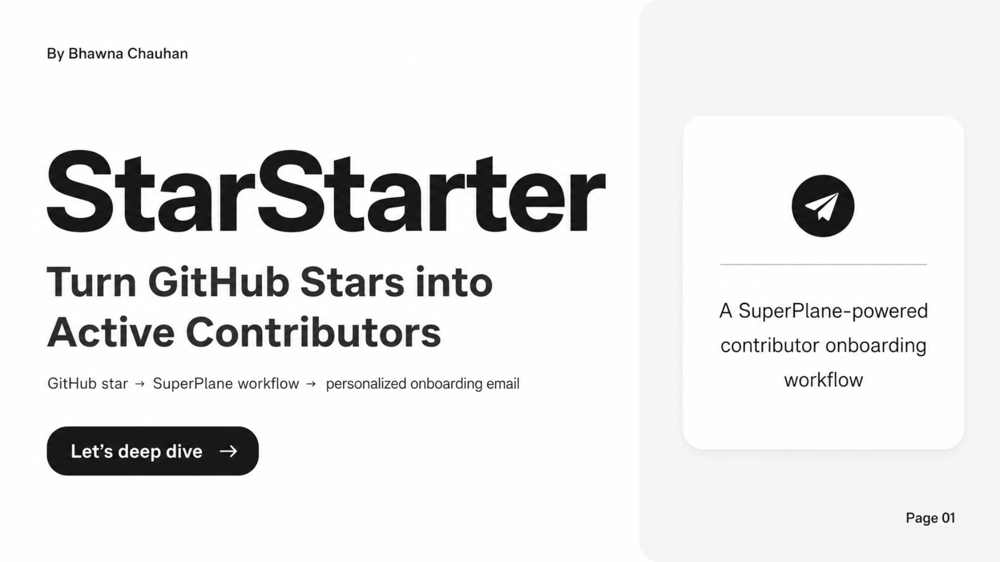
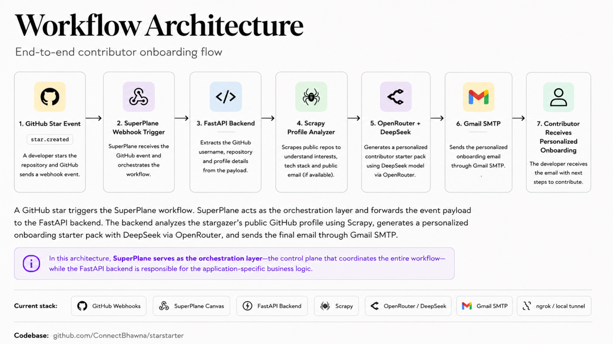

When someone stars the target repository, GitHub sends a webhook into Superplane. Superplane forwards the event to this FastAPI service, which reads the stargazer's public GitHub profile, looks for contribution signals, asks OpenRouter to generate a tailored starter path, and optionally sends the result by email.

The goal is simple: make a new open-source contributor feel seen, welcomed, and pointed toward a useful first contribution.

## Demo


You can also view the inspiration for the StarStarter here: https://canva.link/ipkgj5pckpkhhb7

## What It Does

StarStarter listens for GitHub `star` events and builds a personalized onboarding message for the person who starred the repository.

The service:

- accepts GitHub star webhook payloads from Superplane
- extracts the stargazer username and repository name
- fetches the user's public GitHub profile, repositories, pinned projects, and public email if available
- scrapes the user's public profile page and profile README with Scrapy selectors
- fetches open issues from the starred repository
- uses OpenRouter to generate a personalized contributor email
- returns the generated email payload to Superplane
- can send the email through SMTP with the `/send-email` endpoint

If OpenRouter is not configured, the app still returns a deterministic fallback email so the workflow can be demonstrated end to end.

## How The Flow Works



1. A developer stars the target GitHub repository.
2. GitHub sends a webhook to the public ngrok URL.
3. The gateway routes the GitHub webhook to Superplane.
4. Superplane triggers the workflow shown in the canvas.
5. Superplane calls the FastAPI webhook endpoint at `/webhooks/github/star`.
6. FastAPI enriches the event with public GitHub profile data.
7. The email generator creates a personalized onboarding email.
8. Superplane can either use the generated payload directly or call `/send-email`.
9. The contributor receives a welcome email with suggested first steps.


## Project Structure

```text
.
├── app/
│   ├── main.py                    # FastAPI routes and webhook handling
│   ├── github.py                  # GitHub API enrichment
│   ├── scrapy_profile_scraper.py  # Public profile and README scraping
│   ├── email_scraper.py           # Optional public email discovery
│   ├── analyzer.py                # OpenRouter prompt and email rendering
│   ├── mailer.py                  # SMTP sending
│   ├── models.py                  # Pydantic request/response models
│   └── config.py                  # Environment-based settings
├── assets/
│   ├── StarStarter_Demo.mp4
│   ├── architecture.png
│   ├── backend_logic.png
│   ├── front_page.png
│   └── superplane_canvas.png
├── gateway.py                     # Single public URL router for ngrok
├── requirements.txt
└── README.md
```

## Run Locally

Create and activate a virtual environment:

```bash
python3 -m venv .venv
source .venv/bin/activate
```

Install dependencies:

```bash
pip install -r requirements.txt
```

Copy the example environment file:

```bash
cp .env.example .env
```

Fill in the values you need in `.env`, then start the FastAPI app:

```bash
uvicorn app.main:app --host 127.0.0.1 --port 8011 --reload
```

Check that the API is running:

```text
GET http://127.0.0.1:8011/health
```

Expected response:

```json
{
  "status": "ok"
}
```

## Single ngrok Setup

For the demo, one public URL needs to reach both Superplane and this FastAPI backend. The included gateway handles that routing.

Run Superplane locally on:

```text
http://127.0.0.1:3000
```

Run the FastAPI app on:

```text
http://127.0.0.1:8011
```

Run the gateway on:

```bash
uvicorn gateway:app --host 127.0.0.1 --port 8080
```

Expose only the gateway:

```bash
ngrok http 8080
```

Use the ngrok URL like this:

- GitHub `Payload URL`: `https://<gateway-ngrok-url>/api/v1/webhooks/<superplane-webhook-id>`
- Superplane HTTP node URL: `https://<gateway-ngrok-url>/webhooks/github/star`
- Superplane email node URL: `https://<gateway-ngrok-url>/send-email`

The gateway forwards:

- `/api/v1/*` and the rest of the UI to Superplane on port `3000`
- `/webhooks/*` and `/send-email` to this FastAPI app on port `8011`

## Webhook Endpoint

Superplane should call:

```text
POST /webhooks/github/star
```

Expected payload shape:

```json
{
  "data": {
    "body": {
      "repository": {
        "full_name": "ConnectBhawna/starstarter"
      },
      "sender": {
        "login": "ConnectBhawna"
      }
    }
  }
}
```

The endpoint also accepts a flatter payload:

```json
{
  "github_username": "ConnectBhawna",
  "repository_full_name": "ConnectBhawna/starstarter"
}
```

Successful response:

```json
{
  "email": "developer@example.com",
  "subject": "Welcome to Superplane, ConnectBhawna",
  "body": "<html>...</html>"
}
```

## Sending Email

If the Superplane SMTP component cannot use a dynamic recipient expression, let Superplane call this backend to send email instead.

Call:

```text
POST /send-email
```

Send JSON:

```json
{
  "email": "{{$['Build Email Payload'].data.body.email}}",
  "subject": "{{$['Build Email Payload'].data.body.subject}}",
  "body": "{{$['Build Email Payload'].data.body.body}}"
}
```

If GitHub does not expose a public email for the user, `/send-email` returns `success: false` with `skipped: true` instead of failing the workflow.

Example skipped response:

```json
{
  "success": false,
  "to": null,
  "subject": "Welcome to Superplane, username",
  "skipped": true,
  "detail": "No public recipient email was found for this GitHub user."
}
```

## Environment Variables

Core configuration:

- `GITHUB_TOKEN`: optional, but recommended for higher GitHub API rate limits
- `GITHUB_AUTH_USERNAME`: optional GitHub username used with `GITHUB_TOKEN` by `github-email-scraper`
- `OPENROUTER_API_KEY`: required for LLM-generated emails
- `OPENROUTER_MODEL`: optional, defaults to `openai/gpt-4o-mini`
- `APP_NAME`: sent to OpenRouter as the app title
- `APP_URL`: sent to OpenRouter as the referer

SMTP configuration:

- `SMTP_HOST`
- `SMTP_PORT`
- `SMTP_USERNAME`
- `SMTP_PASSWORD`
- `SMTP_FROM_EMAIL`: optional, defaults to `SMTP_USERNAME`
- `SMTP_FROM_NAME`: optional, defaults to `The Superplane community`
- `SMTP_USE_TLS`
- `SMTP_USE_SSL`

Recommended Gmail app password values:

```text
SMTP_HOST=smtp.gmail.com
SMTP_PORT=587
SMTP_USE_TLS=true
SMTP_USE_SSL=false
```

Recommended SSL-based provider values:

```text
SMTP_PORT=465
SMTP_USE_TLS=false
SMTP_USE_SSL=true
```

## Personalization Logic

The app first uses structured GitHub API data:

- profile name, bio, company, location, blog, followers, and public repo count
- public email, if available
- recently updated repositories
- open issues from the starred repository

It then enriches that data by scraping public GitHub pages:

- `https://github.com/<username>`
- `https://github.com/<username>/<username>`

The scraper looks for:

- profile/about text
- pinned repositories
- rendered profile README sections
- inferred interests from bio, README text, repo descriptions, and languages
- personalization clues that can make the generated email feel specific

Those signals are passed into OpenRouter. If OpenRouter fails or is not configured, StarStarter falls back to a deterministic template.

## Troubleshooting

`POST /webhooks/github/star` returns `200`, but `POST /send-email` is skipped:

The GitHub user probably does not have a public email. This is expected for many profiles.

`POST /send-email` returns `400`:

Check SMTP configuration in `.env`. Missing `SMTP_HOST`, `SMTP_USERNAME`, `SMTP_PASSWORD`, or an invalid recipient email will fail before sending.

GitHub webhook does not trigger the Superplane workflow:

Confirm the GitHub payload URL points to:

```text
https://<gateway-ngrok-url>/api/v1/webhooks/<superplane-webhook-id>
```

Superplane cannot reach FastAPI:

Confirm Superplane calls:

```text
https://<gateway-ngrok-url>/webhooks/github/star
```

and that the gateway is running on port `8080`.

OpenRouter output is missing:

Set `OPENROUTER_API_KEY` in `.env`. Without it, the app intentionally uses the fallback email generator.

## Tech Stack

- FastAPI
- Pydantic Settings
- HTTPX
- Scrapy selectors
- OpenRouter
- GitHub REST API
- Superplane
- SMTP
- ngrok
